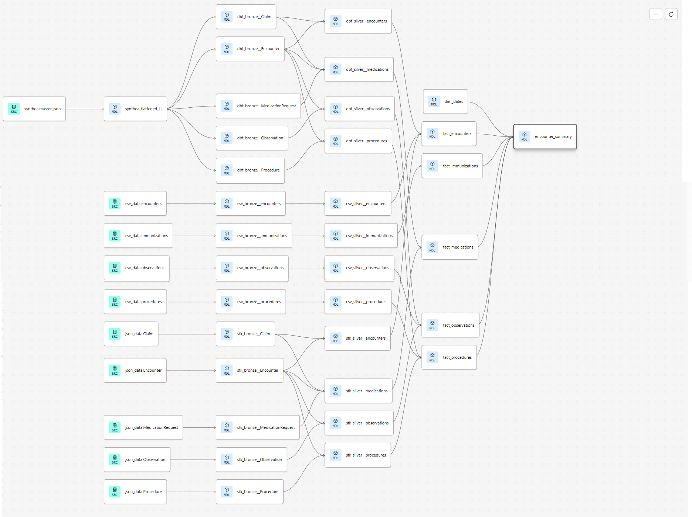
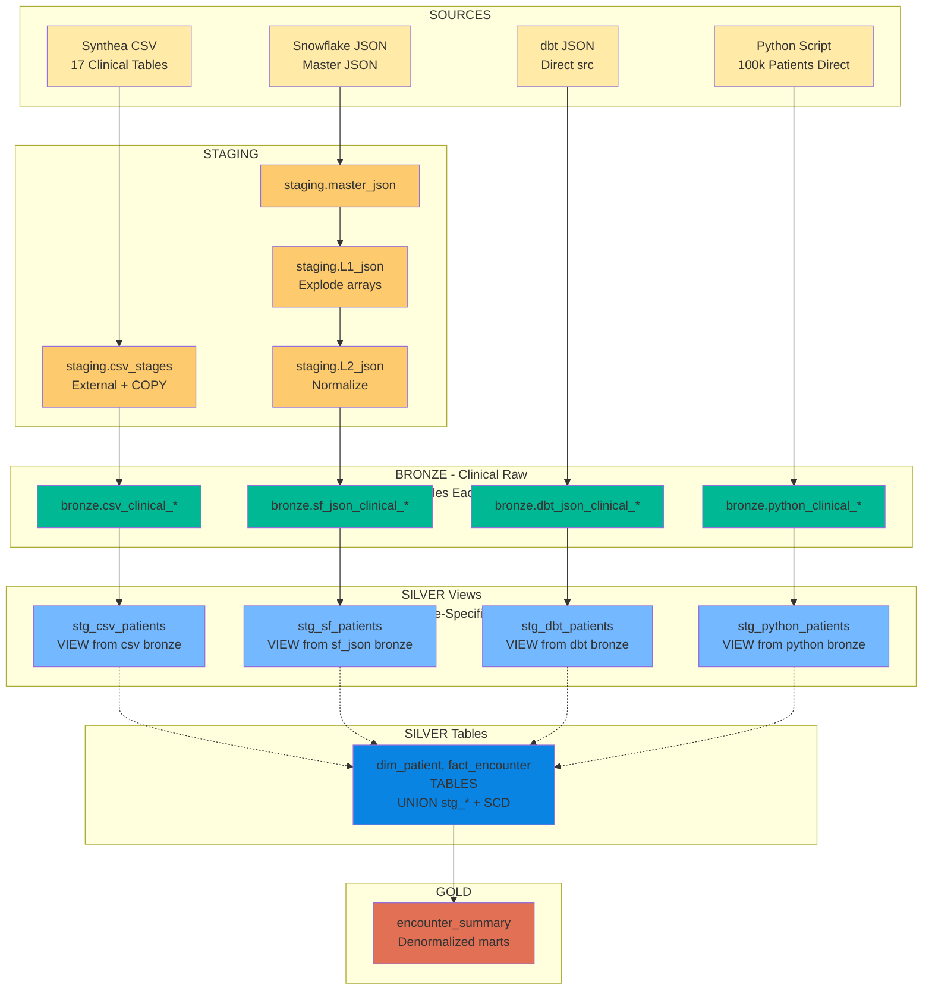

# Healthcare dbt Analytics Pipeline
## Synthea Synthetic Patient Data - Complete Project Documentation


---

**Author**: Ivrama  
**Database**: healthcare_raw (source) → healthcare_analytics (target)  
**Tech Stack**: dbt, Snowflake, Synthea, Python  
**Date**: February 2026  
**Purpose**: DBT Pipeline for FHIR JSON Data



---

## Table of Contents

1. Project Overview
2. Mermaid Architecture & Data Flow
3. Detailed Layer Implementation ← NEW (above tree)
4.  4 Pipeline Strategies
5. Data Sources
6. Quick Start Guide
7. STAR Story (Interview Ready)
8. Sample Queries
9. Lineage & Documentation

---

## 1. Project Overview

This dbt project demonstrates end-to-end healthcare analytics pipelines, evolving from simple CSV ingestion to advanced Synthea JSON processing. Built to showcase senior data engineering skills: hybrid medallion and staging‑TFM architecture, incremental loads, schema evolution, hybrid orchestration (Snowflake SPs + pure dbt), and complete lineage traceability.

**Key Metrics**:
- 53+ dbt models compiled successfully
- 17 FHIR silver tables (patients, encounters, conditions, medications, observations, procedures, etc.)
- 10,000 synthetic patients across 6 batches
- 3 distinct pipeline paradigms in one repository

**Privacy-Safe**: Uses Synthea synthetic data (no PHI/PII) - perfect for GitHub portfolios and interviews.

---
**Lineage**: [View DAG](images/lineage.png) – JSON batches → gold summaries across all pipelines.

## 2. Architecture & Data Flow
### Hybrid Medallion and Staging Transformation Architecture



## 3.  Detailed Layer Implementation
```
STAGING (JSON Raw Ingestion)
├─ healthcare_json_raw.master_json (JSON batches via external stages)
├─ healthcare_sfk_raw.Synthea_Flattened_L1: Flattened variant columns (patient-level JSON)
├─ healthcare_sfk_raw.Synthea_Flattened_L2: Metadata extraction (table_name, column_name, data_type)
├─ healthcare_dbt_raw.Synthea_Flattened_L1: Flattened variant columns (patient-level JSON)
└─ healthcare_dbt_raw.Synthea_Flattened_L2: Metadata extraction (table_name, column_name, data_type)
↓
BRONZE (Raw Ingestion)
├─ healthcare_csv_raw.(patients, encounters, claims, allergies, etc.)
├─ healthcare_sfk_raw.(patients, encounters, claims, allergies, etc.)
├─ healthcare_dbt_raw.(patients, encounters, claims, allergies, etc.)
└─ healthcare_pyt_raw.(patients, encounters, claims, allergies, etc.)

↓
SILVER (Cleaned/Conformed/combined data)
├─ dim_patients
├─ dim_dates
├─ dim_medications
├─ dim_encounter
├─ fact_medications
└─ fact_procedures
↓
GOLD (Analytics Marts)
└─  encounter_summary
```
